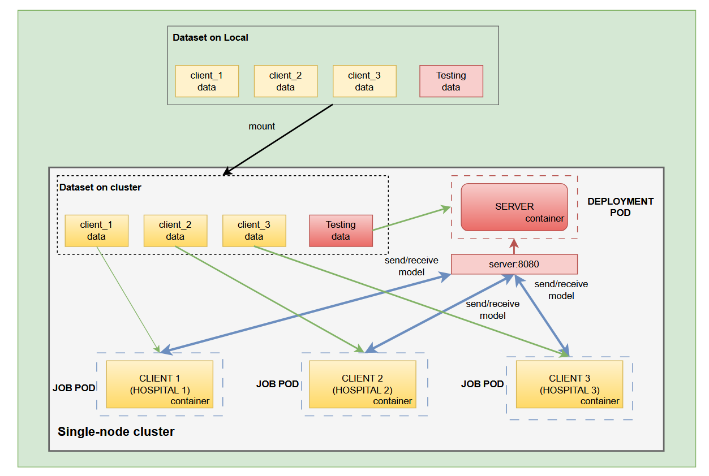

# Federated Learning for Brain Tumor MRI Classification

Dự án nghiên cứu và triển khai Federated Learning cho bài toán phân loại u não từ ảnh MRI sử dụng Kubernetes để mô phỏng môi trường server và các bệnh viện (hospitals).

## 📋 Tổng quan

Dự án này triển khai một hệ thống Federated Learning sử dụng framework Flower (FLwr) để huấn luyện mô hình CNN phân loại u não từ ảnh MRI. Hệ thống được triển khai trên Kubernetes (k8s) với Minikube để mô phỏng:
- **Server**: Trung tâm điều phối quá trình huấn luyện và tổng hợp mô hình
- **Clients**: 3 bệnh viện (hospitals) độc lập, mỗi bệnh viện có dataset riêng và không chia sẻ dữ liệu

## 🎯 Mục tiêu

- Triển khai Federated Learning cho bài toán phân loại ảnh y tế
- Bảo vệ quyền riêng tư dữ liệu (dữ liệu không rời khỏi bệnh viện)
- So sánh hiệu năng giữa Federated Learning và Centralized Learning
- Nghiên cứu các chiến lược aggregation khác nhau (FedAvg vs FedMedian)
- Đánh giá khả năng chống lại các cuộc tấn công từ client malicious

## Dataset 
[Brain Tumor MRI Dataset](https://www.kaggle.com/datasets/masoudnickparvar/brain-tumor-mri-dataset)

## 🏗️ Kiến trúc hệ thống



## 📁 Cấu trúc thư mục

```
NT533-federated_learning/
├── client/                    # Client code (bệnh viện)
│   ├── client.py             # Flower client implementation
│   ├── model.py              # CNN model definition
│   ├── utils.py              # Utility functions
│   ├── Dockerfile            # Docker image cho client
│   └── requirements.txt      # Python dependencies
├── server/                    # Server code (trung tâm)
│   ├── server.py             # Flower server implementation
│   ├── model.py              # CNN model definition
│   ├── utils.py              # Utility functions
│   ├── Dockerfile            # Docker image cho server
│   └── requirements.txt      # Python dependencies
├── k8s/                       # Kubernetes deployment files
│   ├── server-deployment.yaml      # Server với FedAvg strategy
│   ├── server-deployment-median.yaml  # Server với FedMedian strategy
│   ├── service-server.yaml
│   ├── client-job-1.yaml
│   ├── client-job-2.yaml
│   ├── client-job-3.yaml
│   └── client-job-3-malicious.yaml  # Client malicious (tấn công)
├── centralized-training/      # Code cho centralized training (so sánh)
│   ├── main.py
│   ├── model.py
│   └── utils.py
├── dataset/                   # Dataset MRI
│   ├── Testing/              # Testing data
│   └── Clients/              # Dữ liệu đã chia cho từng client
│       ├── client_1/
│       ├── client_2/
│       └── client_3/
├── diagram/                   # Sơ đồ kiến trúc
│   └── architecture.png
├── demo/                      # Video demo
│   ├── normal.mp4            # Demo chạy bình thường
│   └── malicious.mp4         # Demo với client malicious
└── split_dataset.py          # Script chia dataset cho các clients
```

## 🚀 Hướng dẫn triển khai

### Yêu cầu hệ thống

- Docker
- Kubernetes (Minikube)
- Python 3.8+

### Bước 1: Khởi động Minikube cluster

```powershell
minikube start --driver=docker --cpus=4 --memory=4048
```

### Bước 2: Mount dataset vào Minikube

```powershell
minikube mount "F:/Máy tính/NT533-federated_learning/dataset:/data/dataset"
```

Lưu ý: Giữ terminal này chạy trong suốt quá trình thực nghiệm.

### Bước 3: Cấu hình Docker environment để sử dụng Docker daemon của Minikube

Mở terminal PowerShell mới và chạy:

```powershell
minikube -p minikube docker-env | Invoke-Expression
```

### Bước 4: Chia dataset cho các clients (nếu chưa có)

```powershell
python split_dataset.py
```

Script này sẽ chia dữ liệu từ `dataset/Training/` thành 3 phần cho `client_1`, `client_2`, và `client_3`.

### Bước 5: Build Docker images

**Build client image:**
```powershell
cd client
docker build -t fl-client:latest .
cd ..
```

**Build server image:**
```powershell
cd server
docker build -t fl-server:latest .
cd ..
```

### Bước 6: Deploy các services và pods lên Kubernetes

**Triển khai với FedAvg (mặc định):**
```powershell
# Deploy server service
kubectl apply -f k8s/service-server.yaml

# Deploy server pod với FedAvg
kubectl apply -f k8s/server-deployment.yaml

# Deploy các client pods
kubectl apply -f k8s/client-job-1.yaml
kubectl apply -f k8s/client-job-2.yaml
kubectl apply -f k8s/client-job-3.yaml
```

**Triển khai với FedMedian (chống malicious):**
```powershell
# Deploy server service
kubectl apply -f k8s/service-server.yaml

# Deploy server pod với FedMedian
kubectl apply -f k8s/server-deployment-median.yaml

# Deploy các client pods (bao gồm 1 client malicious)
kubectl apply -f k8s/client-job-1.yaml
kubectl apply -f k8s/client-job-2.yaml
kubectl apply -f k8s/client-job-3-malicious.yaml
```

### Bước 7: Theo dõi quá trình huấn luyện

**Xem logs của server:**
```powershell
kubectl logs -f deploy/fl-server
```

**Xem logs của clients (Jobs):**
```powershell
# Lấy tên pod của job
kubectl get pods -l app=fl-client-1
kubectl get pods -l app=fl-client-2
kubectl get pods -l app=fl-client-3

# Xem logs (thay <pod-name> bằng tên pod thực tế)
kubectl logs -f <pod-name>

# Hoặc xem logs trực tiếp từ job
kubectl logs -f job/fl-client-1
kubectl logs -f job/fl-client-2
kubectl logs -f job/fl-client-3

# Nếu có client malicious
kubectl logs -f job/fl-client-3-malicious
```

### Bước 8: Kiểm tra trạng thái pods

```powershell
kubectl get pods
kubectl get services
```

## 📊 Kết quả thực nghiệm

### FL vs Centralized Learning (Normal Clients)

| Model | Accuracy (%) | F1-score (%) |
|-------|--------------|--------------|
| Centralized Learning | 82.77 | 79.8 |
| FL FedAvg (Round 1) | 71.6 | 69.6 |
| FL FedAvg (Round 2) | 76.9 | 75.2 |

**Nhận xét:**
- FL với client bình thường đạt hiệu năng tiệm cận Centralized Learning sau vài round

### FL with Malicious Clients

| FL Setting | Accuracy (%) | F1-score (%) |
|------------|--------------|--------------|
| FedAvg (1/3 Mal., R1) | 25.0 | 19.0 |
| FedAvg (1/3 Mal., R2) | 28.0 | 10.0 |
| FedMedian (1/3 Mal., R1) | 73.0 | 72.0 |
| FedMedian (1/3 Mal., R2) | 77.0 | 76.0 |

**Nhận xét:**
- FedAvg suy giảm mạnh khi có malicious clients
- FedMedian giúp FL duy trì độ chính xác và độ ổn định

## 🎬 Demo

### Demo chạy bình thường (FedAvg)

<video src="demo/normal.mp4" controls width="800"></video>

### Demo với client malicious và FedMedian

<video src="demo/malicious.mp4" controls width="800"></video>

**Lưu ý**: 
- Video có thể không hiển thị trực tiếp trên GitHub. Để xem video, bạn có thể:
  - Mở file `demo/normal.mp4` hoặc `demo/malicious.mp4` trực tiếp trên máy tính
  - Hoặc clone repository về và mở file README.md bằng trình đọc markdown hỗ trợ video (như VS Code với Markdown Preview Enhanced)
- `demo/normal.mp4` - Demo chạy bình thường với FedAvg strategy
- `demo/malicious.mp4` - Demo với client malicious và FedMedian strategy để chống lại tấn công

## 🔧 Cấu hình

### Server Configuration
- Port: 8080
- Strategy: 
  - **FedAvg** (Federated Averaging): Tổng hợp trung bình các model weights
  - **FedMedian**: Tổng hợp theo median để chống lại các client malicious
- Min clients: 3
- Evaluation: Sử dụng test dataset sau mỗi round

### Client Configuration
- Local epochs: 2
- Batch size: 4
- Optimizer: SGD với learning rate 0.01
- Loss function: CrossEntropyLoss
- **Malicious Client**: Client có thể gửi model weights độc hại để tấn công hệ thống (được test với FedMedian để đánh giá khả năng phòng thủ)

### Model Architecture

SimpleCNN với cấu trúc:
- Conv2d(3 → 8 channels) + ReLU + MaxPool
- Conv2d(8 → 16 channels) + ReLU + MaxPool
- Fully Connected (16×56×56 → 64) + ReLU
- Fully Connected (64 → num_classes)

## 🧪 So sánh với Centralized Training

Để chạy centralized training để so sánh:

```powershell
cd centralized-training
python main.py
```

## 📚 Thư viện sử dụng

- **Flower (FLwr)**: Framework cho Federated Learning
- **PyTorch**: Deep learning framework
- **Kubernetes**: Container orchestration
- **Docker**: Containerization

## 🔍 Troubleshooting

### Vấn đề: Pods không khởi động được

- Kiểm tra images đã được build đúng chưa: `docker images | grep fl-`
- Kiểm tra logs: `kubectl describe pod <pod-name>`

### Vấn đề: Client không kết nối được với Server

- Kiểm tra service đã được tạo: `kubectl get svc`
- Kiểm tra SERVER_ADDRESS trong client deployment

### Vấn đề: Không mount được dataset

- Đảm bảo terminal mount đang chạy
- Kiểm tra đường dẫn dataset trong mount command

## 📝 Ghi chú

- Dataset phải được chia thành các thư mục class (ví dụ: glioma, meningioma, pituitary, no_tumor)
- Mỗi client chỉ có quyền truy cập dữ liệu của mình
- Server chỉ nhận model weights từ clients, không nhận dữ liệu thô

## 👥 Tác giả

Lê Văn Hoàng - 22520465

